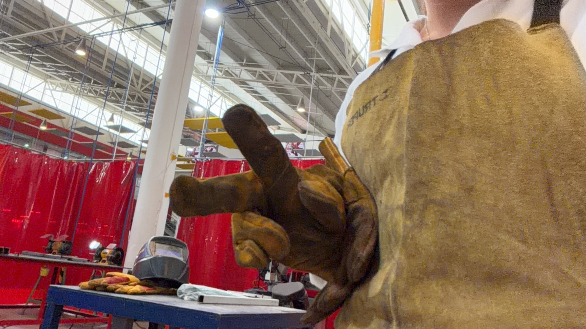
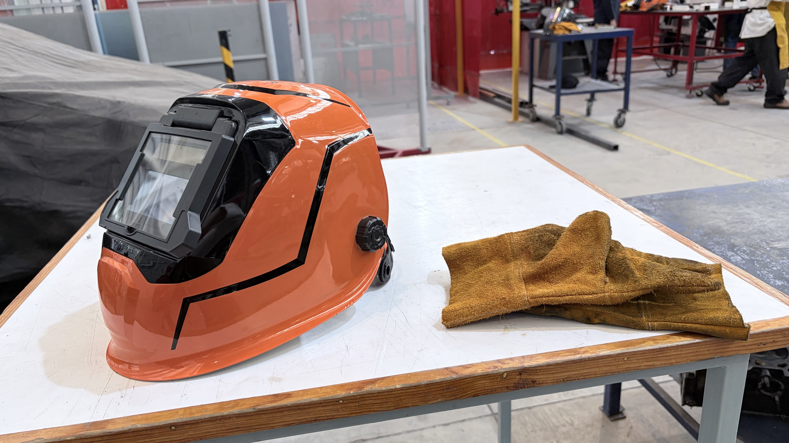
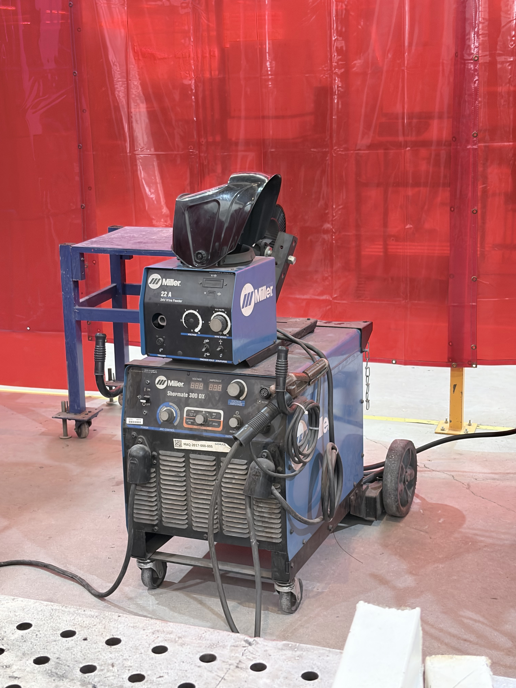
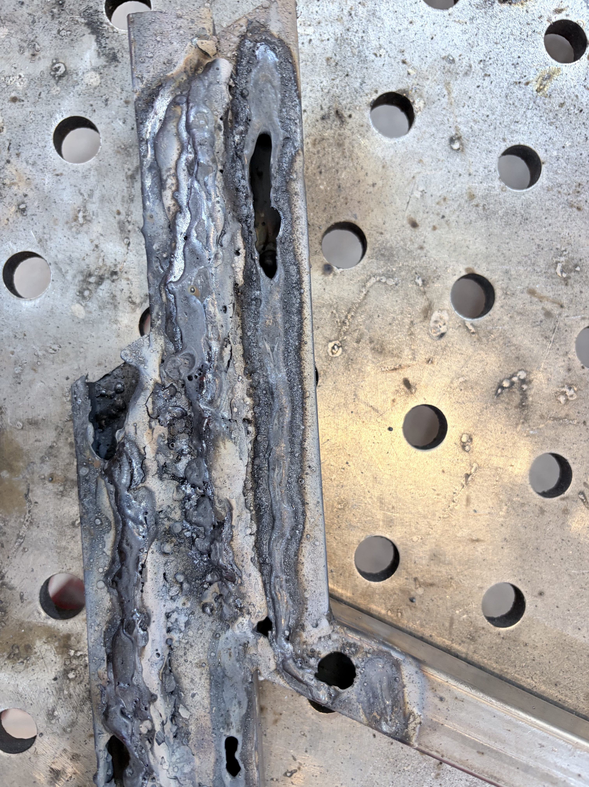
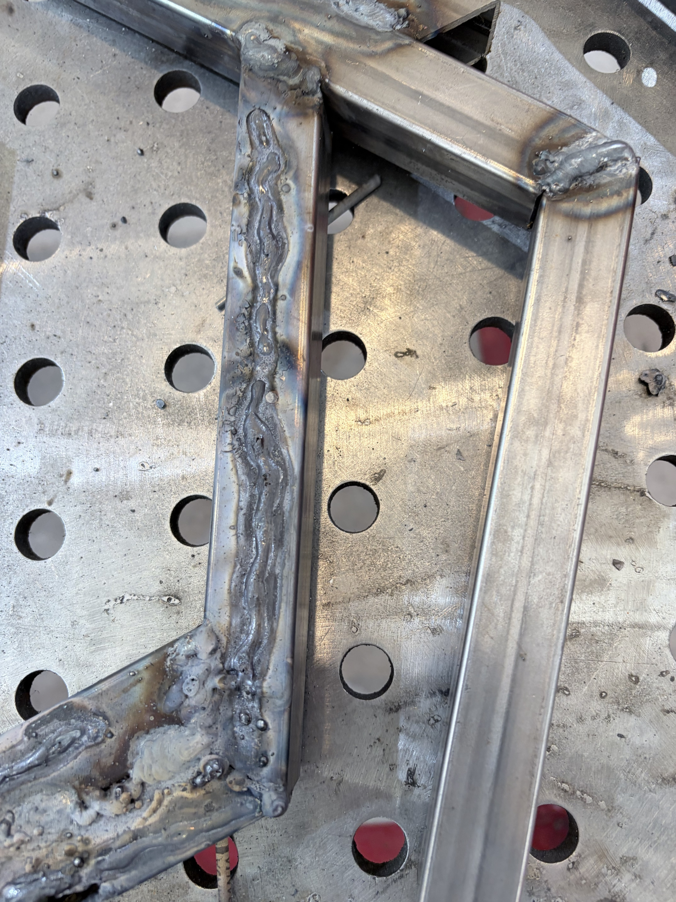
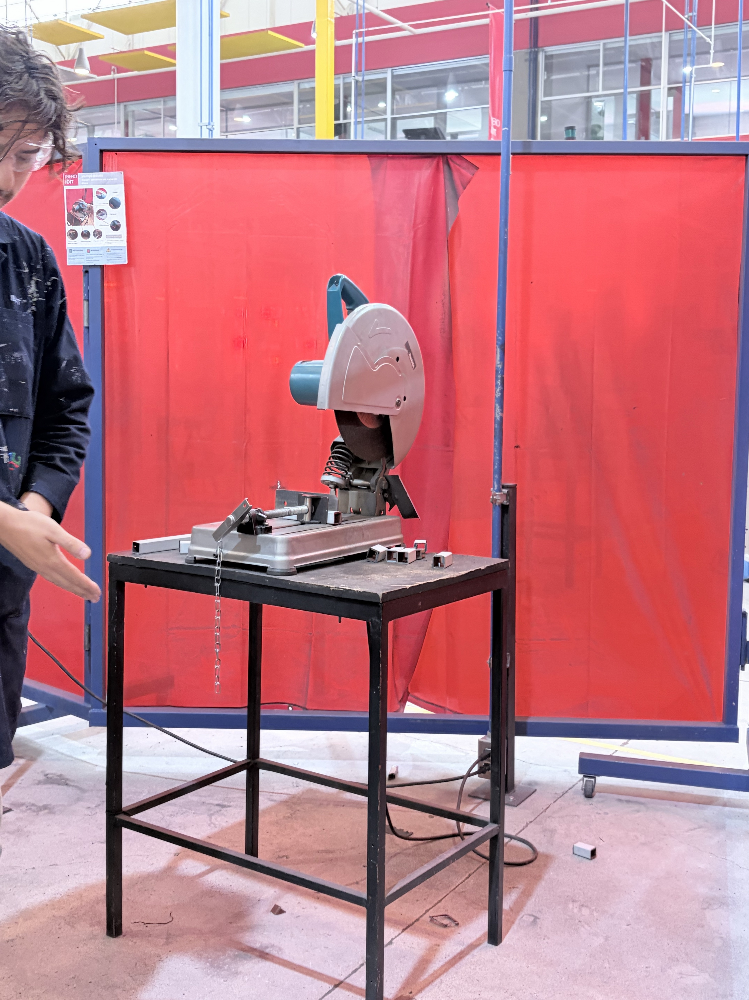
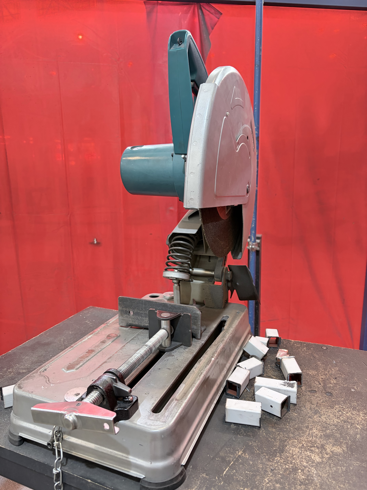
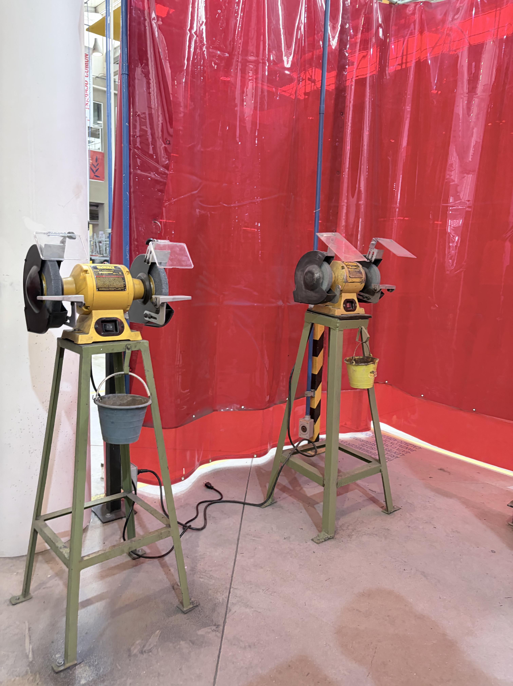
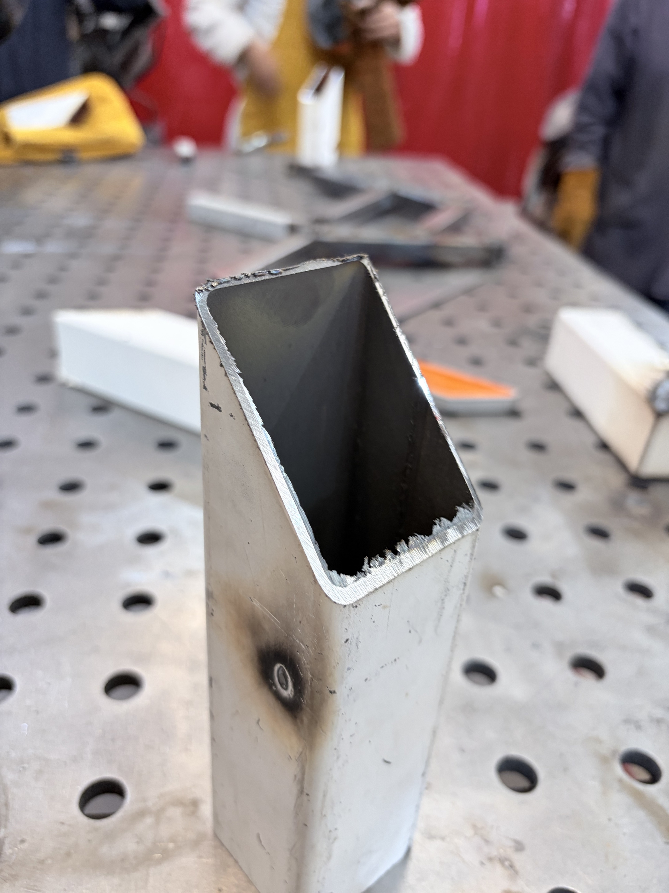

# Soldadura, Corte y Pulido

Realizamos un recorrido por la Explanada para aprender el uso correcto de equipos de soldadura por arco, cortaadoras y esmeriles de banco, priorizando en todo momento la seguridad y las buenas prácticas de taller

---

## 1. Equipo de Protección y Protocolos
Antes de operar cualquier maquinaria o iniciar procesos térmicos, es obligatorio cumplir con el equipo de seguridad correspondiente según el tipo de área:

* **Protección general:** Botas de seguridad con casquillo, bata o overol de trabajo, se puede complementar opcionalmente con un peto de cuero/carnaza para mayor protección
* **Gafas de seguridad:** Obligatorias en todo momento en el taller para proteger los ojos contra chispas, virutas y salpicaduras metálicas
* **Guantes de carnaza y careta fotosensible:** Indispensables para la soldadura. La careta se oscurece automáticamente al detectar la luz del arco eléctrico para proteger la vista contra la radiación UV e infrarroja

{ width=35% }  { width=35% }

---

## 2. Soldadura por Arco Eléctrico

Utilizamos una soldadora industrial marca **Miller** para el proceso de soldadura por arco con **electrodo revestido**

{ width=35% }

### Configuración y Técnica de Soldadura:
1. **Conexión y ajuste:** Se enciende el equipo y se ajusta la corriente en **Amperios** según el grosor del material
2. **Ejecución:**
   * Se mantiene el brazo en una posición estable (aprox. 90° respecto a la junta)
   * El electrodo debe mantenerse **muy cerca del metal** sin tocarlo fijamente ni alejarlo demasiado, avanzando a una velocidad constante
   * *Nota de técnica:* Avanzar muy rápido o mantener el electrodo muy alejado quema el material; ir muy lento acumula exceso de calor (igual lo quema)

{ width=35% }  { width=35% } 

---

## 3. Corte de Metal

Para el cortado de barras metálicas utilizamos la **tronzadora de disco abrasivo**, la cual permite realizar cortes rectos a 90° y hay otra que hace cortes a 45°

{ width=35% }  { width=35% } 

### Criterios Operativos y Seguridad:
* **Seguridad:** No requiere careta de soldar ni guantes, pero **las gafas de seguridad son estrictamente obligatorias**
* **Operación:** Se presionan los botones de seguridad del mango y se baja el disco con una **presión constante** 
  * *Riesgos:* Bajar demasiado rápido puede afilar o romper el disco; dejarlo fijo en un solo punto sobrecalienta el metal y desgasta el disco en vano
* **Finalización del corte:** Hay que bajar el disco hasta sentir que ha atravesado por completo el material antes de retornar el brazo a su posición inicial
* **Orientación del material:** Para optimizar la geometría circular del disco, las piezas rectangulares o perfiles se deben colocar sobre su sección más angosta, garantizando que el disco alcance la profundidad total del corte

---

## 4. Limpieza y Desbaste con Esmeril de Banco

Una vez cortadas las piezas, se pasa al **esmeril de banco** (piedra de esmerilar) para el acabado final

* **Objetivo:** Retirar **rebabas**, limar bordes filosos y dejar las superficies limpias antes de soldar
* **Seguridad:** Se opera únicamente con **gafas de seguridad**
* **Técnica:** Se acerca la pieza firmemente contra la piedra en rotación de manera uniforme hasta obtener un acabado liso y seguro para el ensamble

{ width=35% } { width=35% }

