# Mediciones y Maquinas

## 1. Instrumentos de Medición de Precisión

### Calibrador Vernier
Es un instrumento de medición directa con una resolución de 0.05mm. Permite tomar dimensiones exteriores, interiores y profundidades mediante una regla graduada fija y una escala deslizante

* **Mordazas exteriores:** Para medir largos, anchos y grosores
* **Puntas interiores:** Para medir diámetros de agujeros y ranuras
* **Varilla de profundidad:** Para medir la profundidad de cavidades

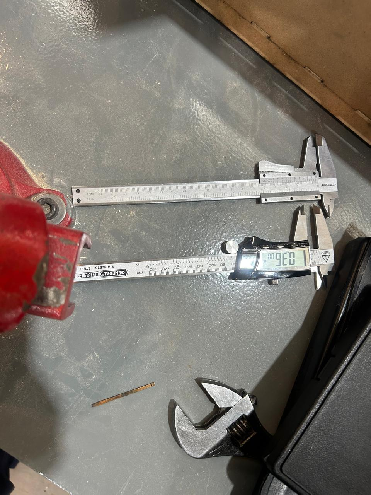{ width=48% }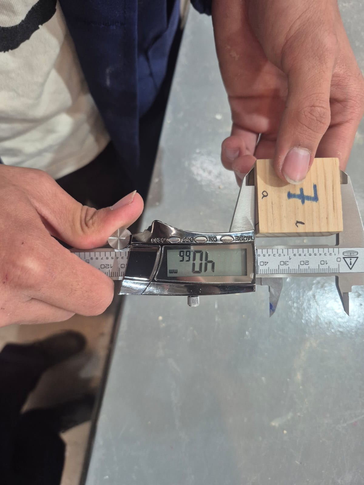{ width=48% }

---

### Micrómetro
Instrumento de alta precisión basado en un tornillo micrométrico. Permite realizar mediciones con una resolución de 0.01mm. Cuenta con una escala lineal en el cilindro y un tambor giratorio con trinquete de apriete para no deformar la pieza medida.

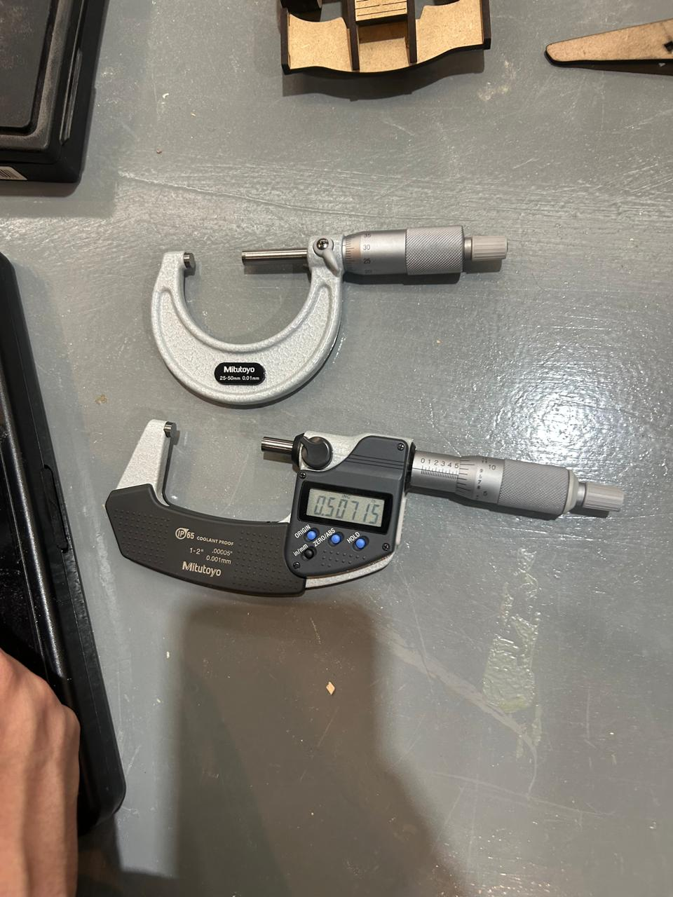{ width=48% }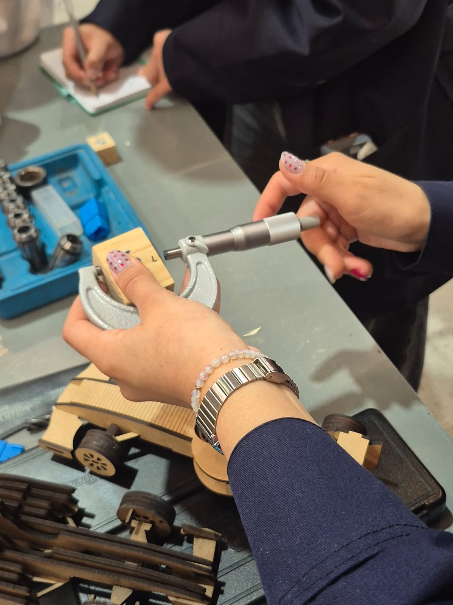{ width=48% }

---

## 2. Práctica de Medición: Cubos de Madera

Como parte del ejercicio práctico, se caracterizaron dimensionalmente diferentes bloques de madera numerados, comparando mediciones obtenidas tanto con el Vernier como con el micrómetro

### Mediciones con Vernier

| Bloque # | Largo (mm) | Ancho (mm) | Grosor (mm) |
| :---: | :---: | :---: | :---: |
| **8** | 45.62 | 31.65 | 32.33 |
| **7** | 40.57 | 36.66 | 18.65 |
| **14** | 28.72 | 41.69 | 20.25 |
| **16** | 37.05 | 29.86 | 25.49 |
| **18** | 35.89 | 46.92 | 21.80 |

### Mediciones con Micrómetro

| Bloque # | Largo (mm) | Ancho (mm) | Grosor (mm) |
| :---: | :---: | :---: | :---: |
| **5** | 27.45 | 24.11 | 23.17 |
| **6** | 43.25 | 32.27 | 28.43 |
| **14** | 29.27 | 42.16 | 20.25 |
| **15** | 50.48 | 47.37 | 21.69 |
| **17** | 41.14 | 32.21 | 25.00 |

---

## 3. Mecanizado: Brocas vs. Fresas

Durante la explicación de herramientas de corte para mecanizado, se destacaron las siguientes diferencias geométricas y de operación:

* **Broca:** Diseñada exclusivamente para hacer **perforaciones axiales** (avanzando hacia abajo en el eje Z)
* **Fresa:** Diseñada principalmente para **cortar hacia los lados** (desplazamiento lateral en ejes X e Y). Aunque algunas fresas pueden profundizar axialmente, no es su función principal
* **Regla de cantidad de filos:** *A mayor cantidad de filos en la fresa, el material a cortar puede ser más duro, pero la velocidad de remoción es más lenta*

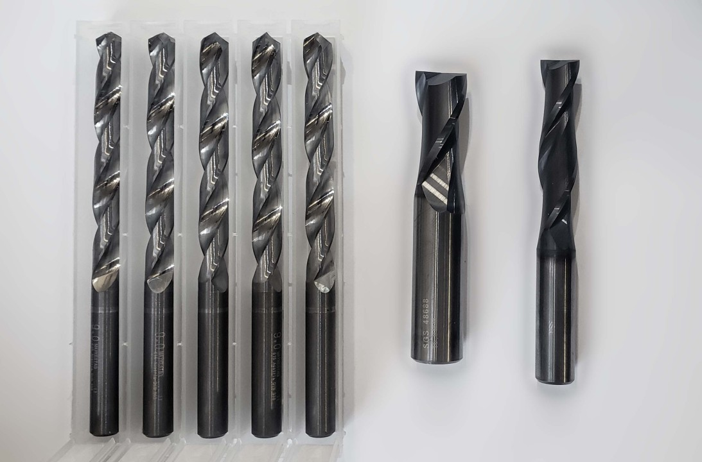{ width=50% }  
**No me pasaron para tomarle foto :P**
---

## 4. Máquinas 

### Fresadora Vertical
Es una máquina herramienta utilizada para el mecanizado de piezas mediante el arranque de viruta con una herramienta rotativa multicorte (fresa). Permite realizar planeados, ranurados, rebajes y perfilados de alta precisión en diversos materiales

- **Ajuste de altura y nivelación:** Cuenta con una manivela o palanca lateral que desplaza verticalmente el cabezal o la mesa para calibrar la profundidad de corte exacta sobre la pieza
- **Control de velocidad:** Dispone de un selector mecánico o de poleas para configurar los rangos de **velocidad mínima y máxima**. Mediante este sistema se selecciona las revoluciones por minuto (RPM) adecuadas dependiendo de la dureza del material a trabajar
- **Puesta en marcha:** El encendido sigue una secuencia de seguridad: se gira la perilla selectora para definir el sentido de giro y rango de velocidad, y posteriormente se presiona el botón de arranque principal
- **Sujeción de la pieza:** Cuenta con una mesa de trabajo ranurada donde se fija firmemente la pieza (o un bloque de madera/metal) mediante un tornillo de banco o prensas de sujeción para evitar cualquier vibración o desplazamiento peligroso durante el mecanizado

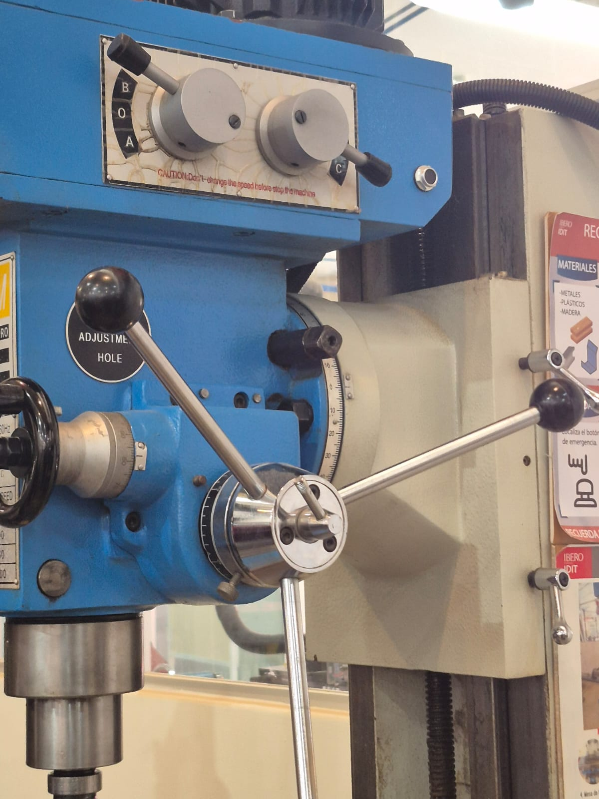{ width=28% }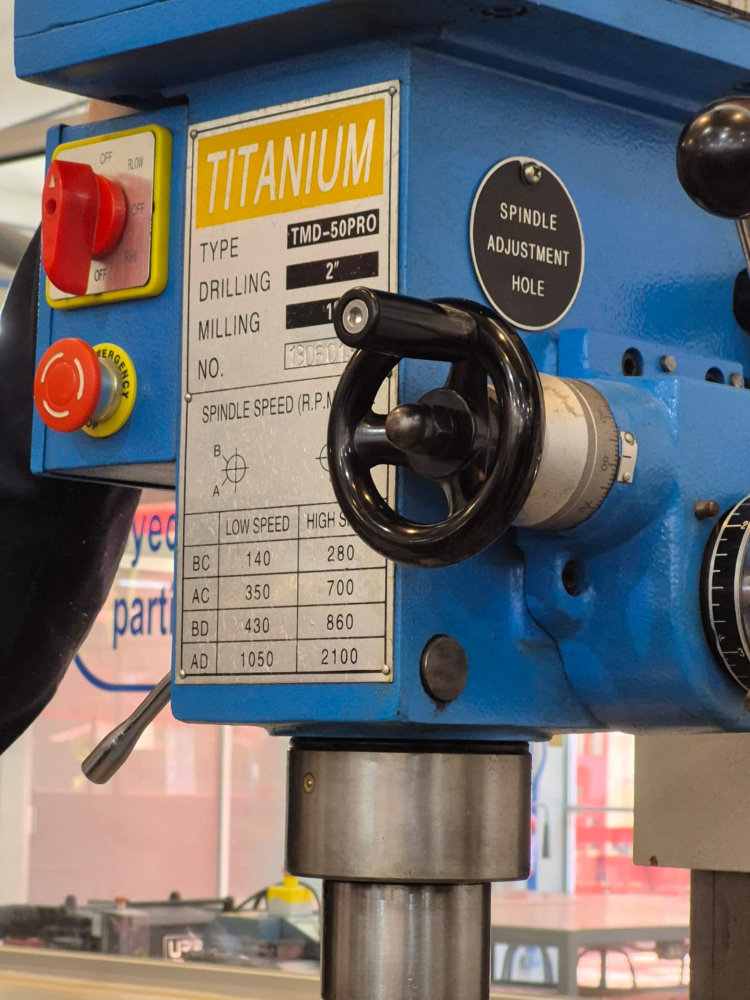{ width=28% }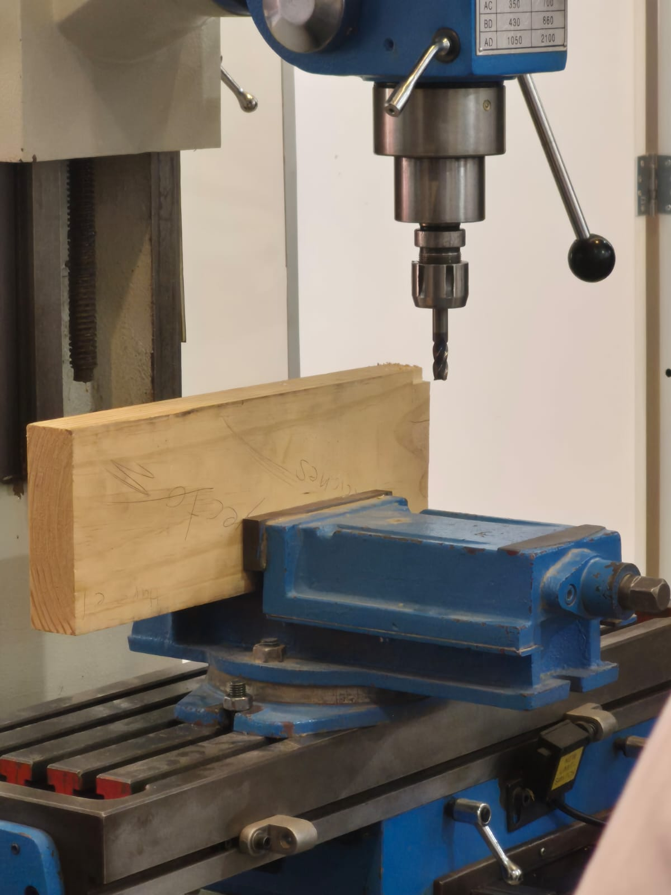{ width=28% }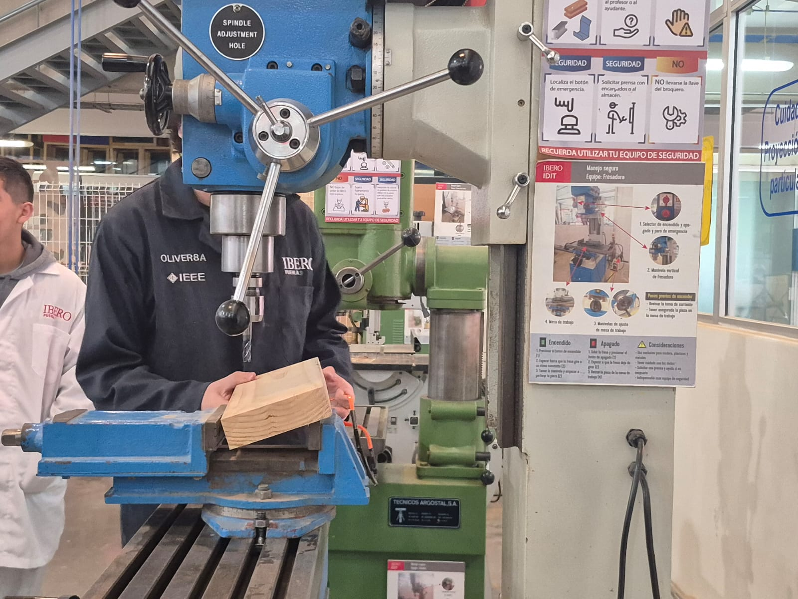{ width=48% }

[*Demostración de funcionamiento: Fresadora*](./img_taller/uso_fresadora.mp4)  

### Sierra de Cinta 
Máquina de corte continuo mediante una hoja metálica dentada en bucle  
**Procedimiento de encendido en 3 pasos:**  
 1. Encender el **switch trasero** principal  
 2. Activar la **palanca delantera**  
 3. Presionar el **botón delantero** de arranque  

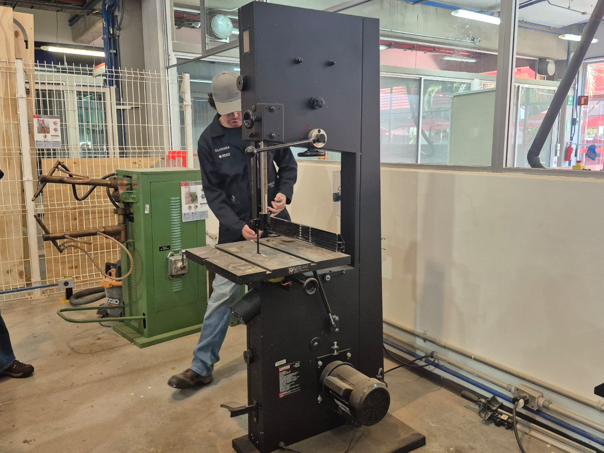{ width=48% }

---

### Guillotina de Lámina
Máquina verde de cizallado mecánico para realizar cortes rectos y limpios en láminas de metal  
**Límite de capacidad:** Diseñada para cortar lámina con un espesor máximo de 1.5mm

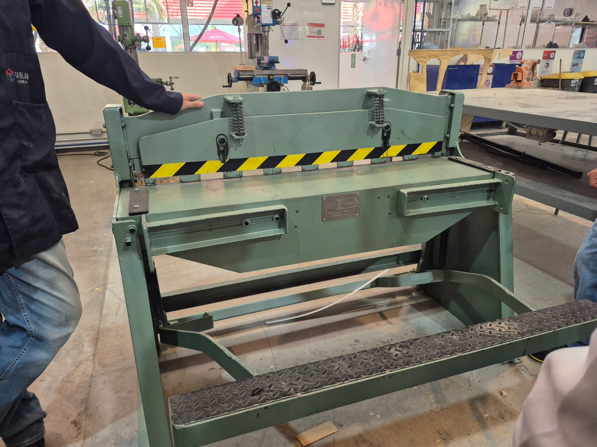{ width=48% }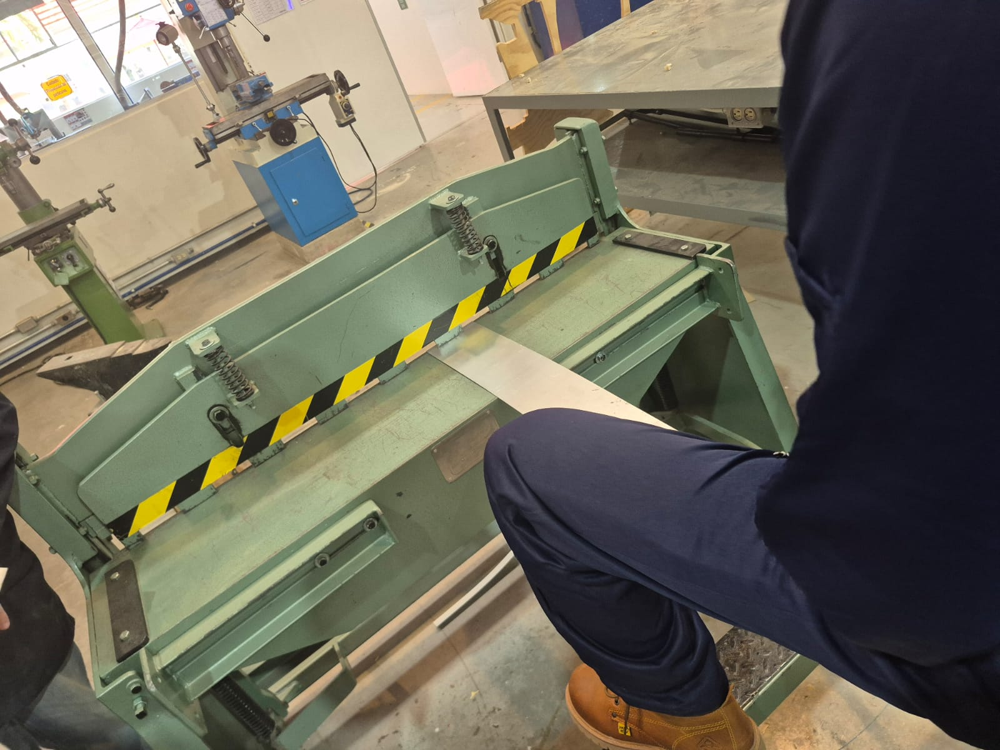{ width=48% }

---

### Dobladora de Lámina
Equipo utilizado para la deformación plástica y prensado de metal en ángulos rectos o pestañas  
**Uso:** Sirve para **doblar y prensar** láminas respetando el límite de espesor del taller (1.5mm)

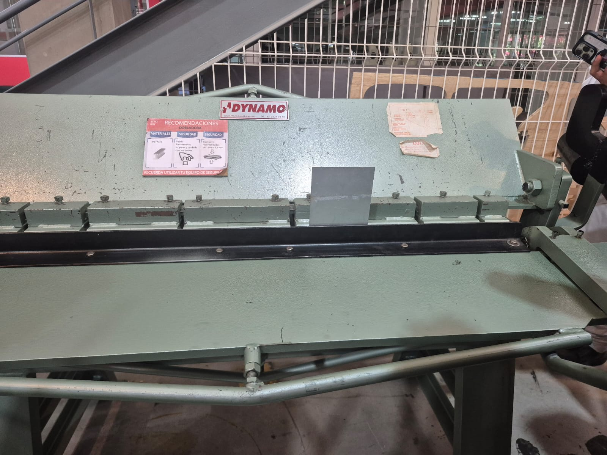{ width=48% }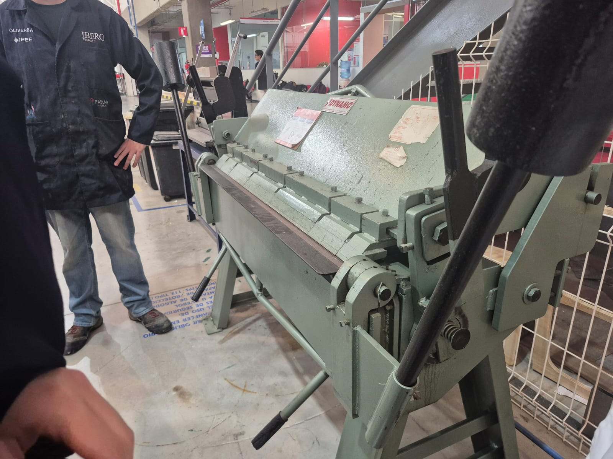{ width=48% }

---

### Soldadura por Puntos (RSW)
Proceso de unión por resistencia eléctrica donde se aprisionan dos láminas metálicas entre dos electrodos de cobre. Al aplicar presión y un pulso de corriente de alto amperaje, el metal se funde localmente creando una unión rápida sin necesidad de material de aporte

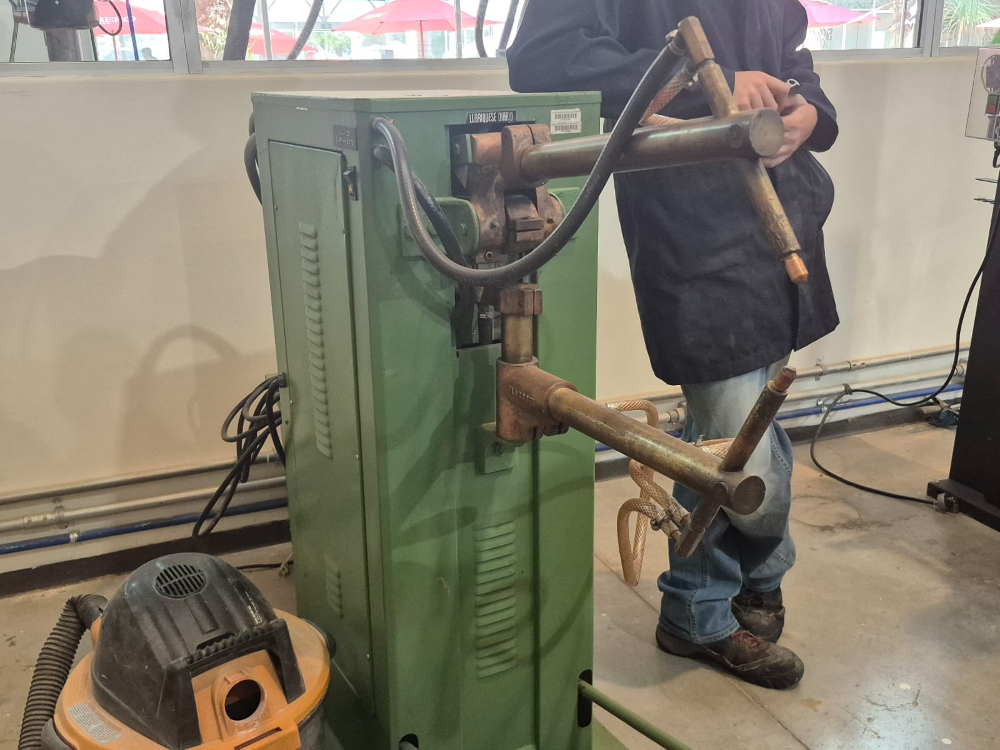{ width=48% }