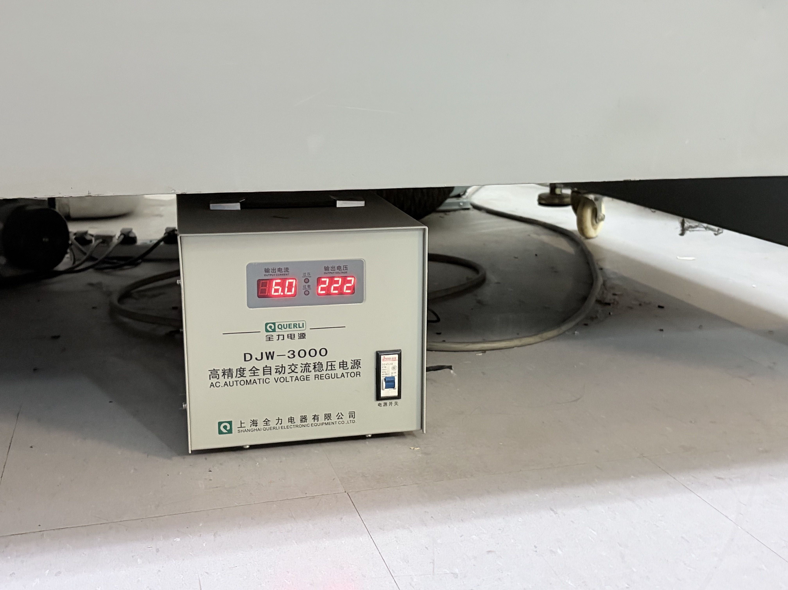
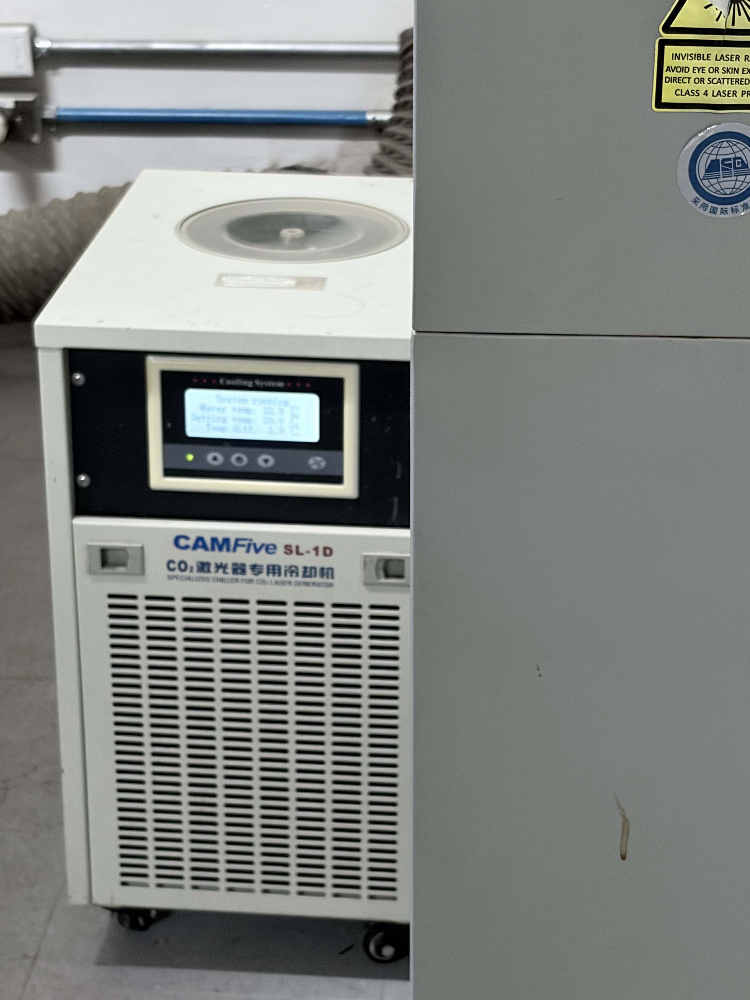
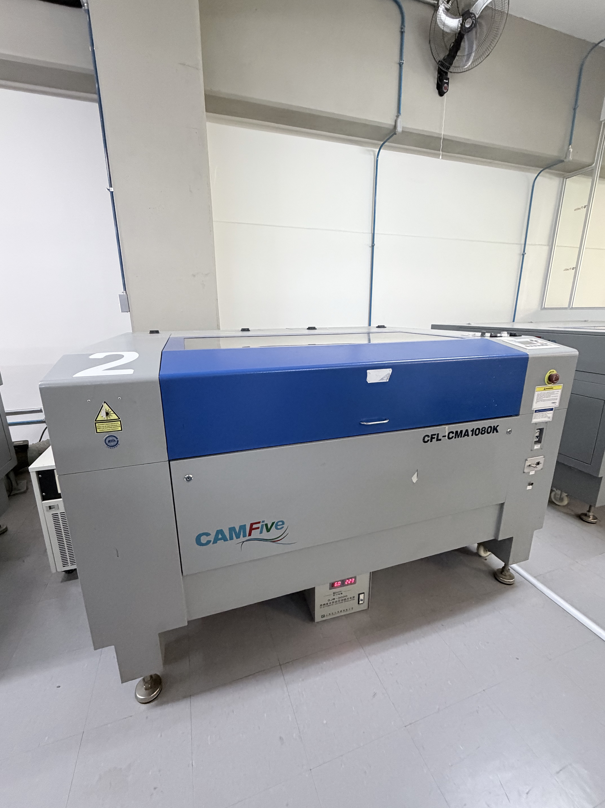
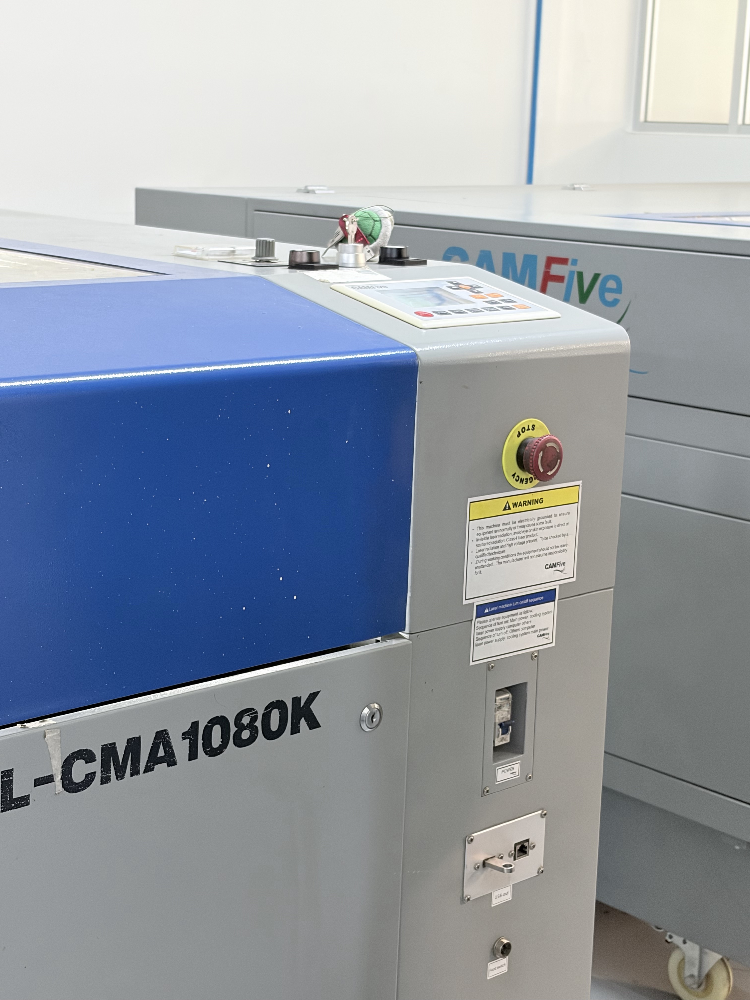
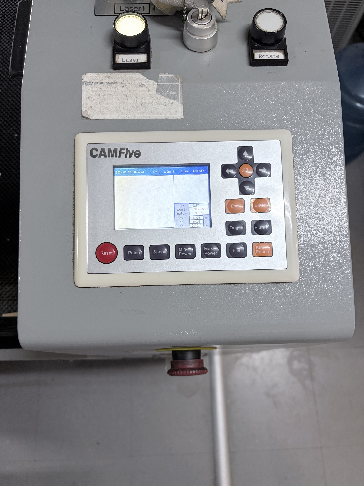
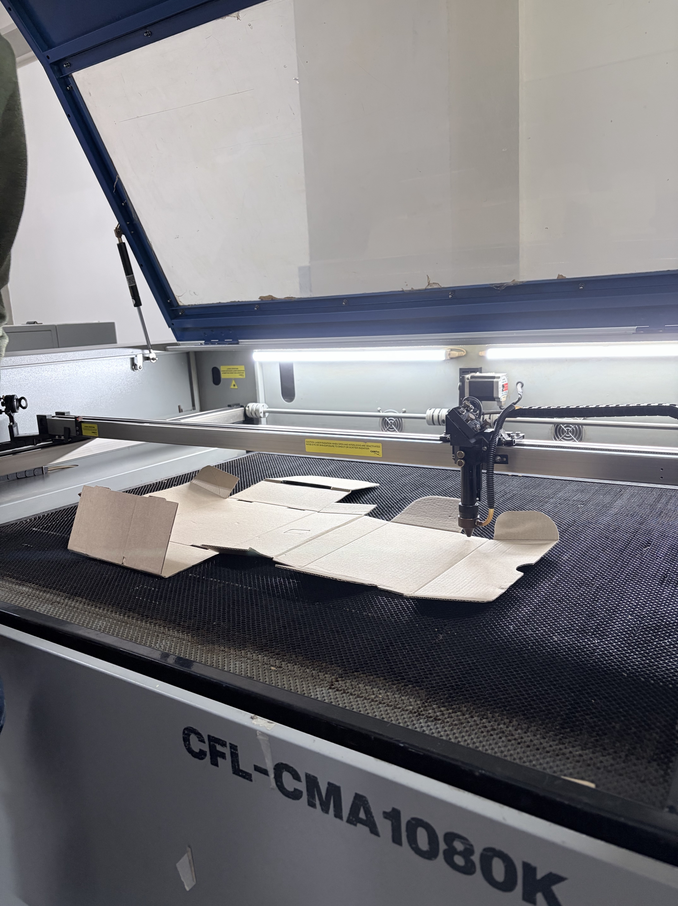
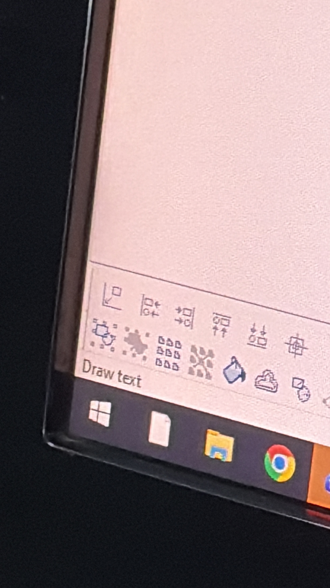

# Cortadora Láser

En esta sesión aprendimos el protocolo de seguridad, encendido, calibración y envío de archivos para la fabricación de piezas en la cortadora láser **CAMFive**

---

## 1. Inspección Previa y Sistema de Enfriamiento
Antes de encender el equipo principal, se debe verificar el estado del sistema:
1. **Encendido base:** Se acciona el interruptor general ubicado en la parte inferior de la máquina
2. **Verificación de la Enfriadora:** Es **estrictamente obligatorio** comprobar que el enfriador encienda y funcione correctamente.
   * *Riesgo crítico:* Operar el láser sin enfriamiento adecuado causa sobrecalentamiento de inmediato, provocando pérdida de potencia, fracturas o choque térmico que destruye el módulo.

{ width=35% }  
{ width=35% }  { width=35% }

---

## 2. Secuencia de Encendido en 3 Pasos
Una vez activo el sistema de enfriamiento, el panel lateral derecho requiere tres pasos de seguridad:

1. Subir la **palanquilla / interruptor principal**
2. Girar y desenclavar el **botón de Paro de Emergencia**
3. Insertar y girar la **llave de seguridad** para habilitar el energizado del sistema

{ width=35% }

---

## 3. Configuración del Origen y Enfoque

### Ajuste de Coordenadas en Panel:
* **Flechas de dirección:** Mueven la cabeza del láser sobre la mesa de trabajo.
* **Botón `Origin`:** Establece las coordenadas del punto de inicio del corte.
* **Botón `Esc` (doble toque):** Regresa la cabeza del láser automáticamente al origen configurado.

{ width=35% }

### Calibración de la Boquilla (Distancia Focal):
* La distancia estándar requerida entre la boquilla y el material es de **5 mm** (equivalente al grosor de una memoria USB estándar).
* **Diagnóstico visual:**
    * ✗ **Punto grueso:** Indica mala calibración; el haz pierde densidad y solo quema la superficie sin atravesar.
    * ✓ **Punto fino y limpio:** Indica calibración exacta; el haz alcanza su máxima densidad de potencia y realiza un corte delgado (*kerf*) atravesando el material.

{ width=35% }

---

## 4. Flujo de Trabajo en Software SmartCarve 4

1. **Licencia:** Conectar la llave de protección por hardware para poder abrir el software **SmartCarve 4**.
2. **Importación:** Importar el archivo (formato `.DXF`).
3. **Centrado:** Alinear y centrar el diseño respecto al origen definido usando la herramienta del programa.
4. **Comprobación (`Go Scale`):** Ejecutar la función *Go Scale* en la máquina para que el láser recorra el perímetro del área a cortar sobre el material.
5. **Activación del Láser y Ejecución:** Presionar el botón físico de **Encender Láser** en la máquina (obligatorio para permitir la emisión del laser) y presionar el botón de corte en el software.

{ width=35% }

---

## 5. Restricciones y Seguridad de Materiales

No todos los materiales son aptos para la cortadora láser CO2 debido a riesgos de reflexión óptica, fuego o corrosión:

*  **Materiales no aptos:**
     * **Materiales reflectantes / Vidrio / Acrílico blanco espejo:** Reflejan o rebotan la luz del láser dañando los lentes o perdiendo eficacia.
     * **PVC y Policarbonatos:** Desprenden gases tóxicos y vapores ácidos que dañan la salud y corroen la óptica de la máquina.