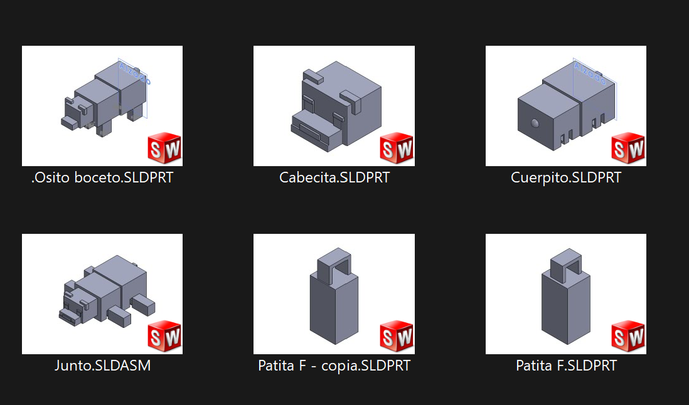
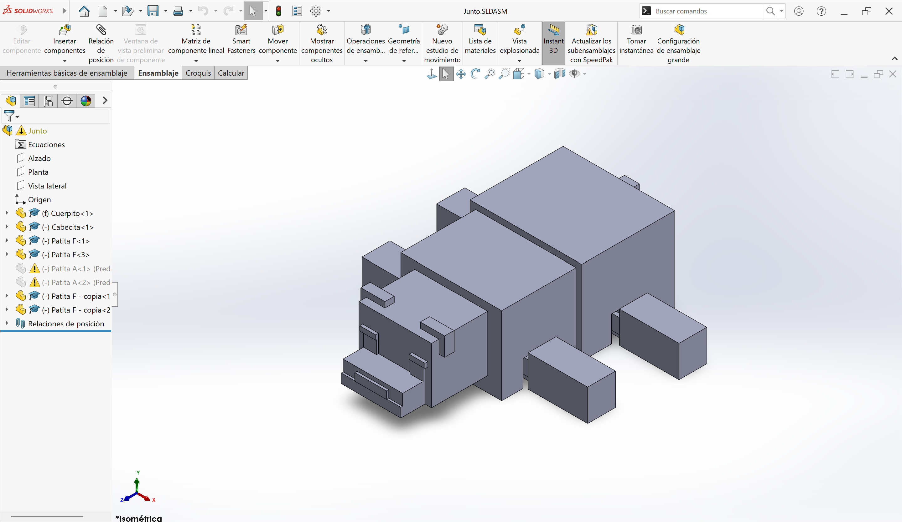
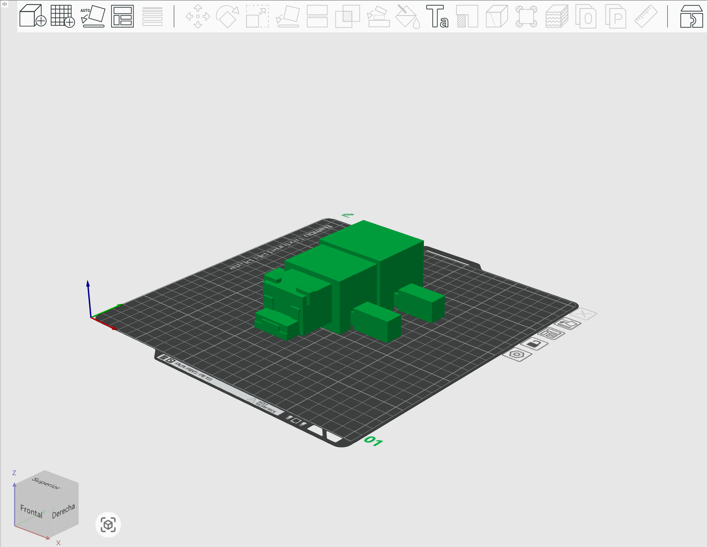
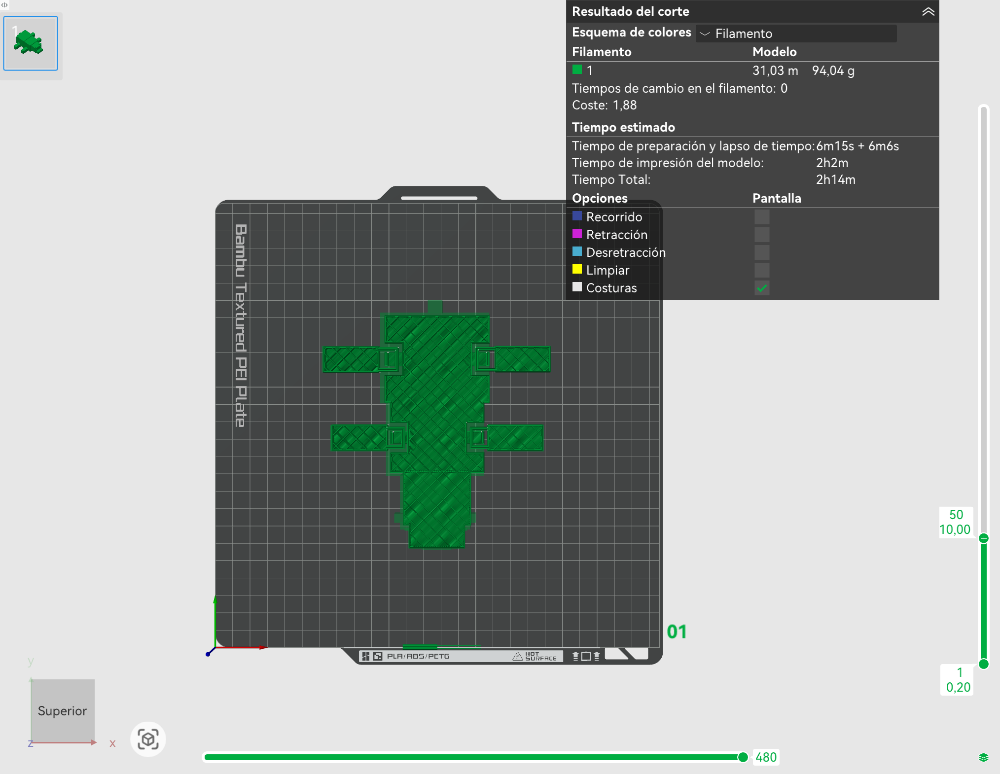
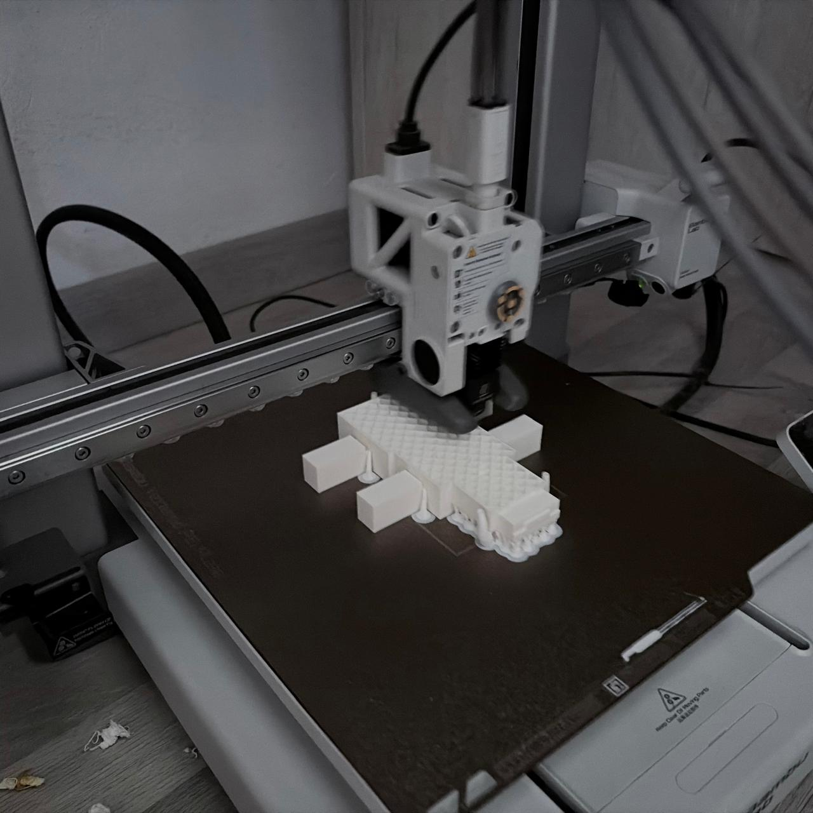
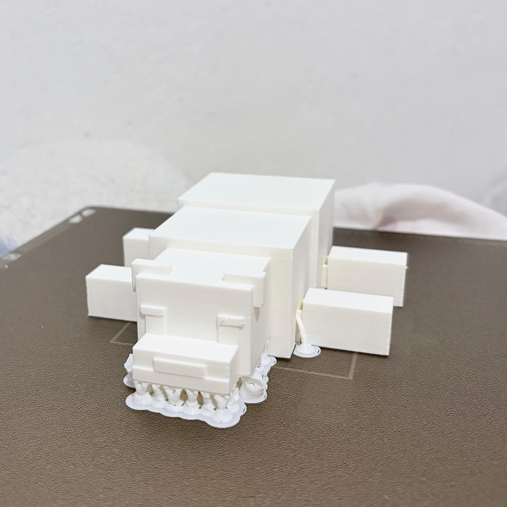
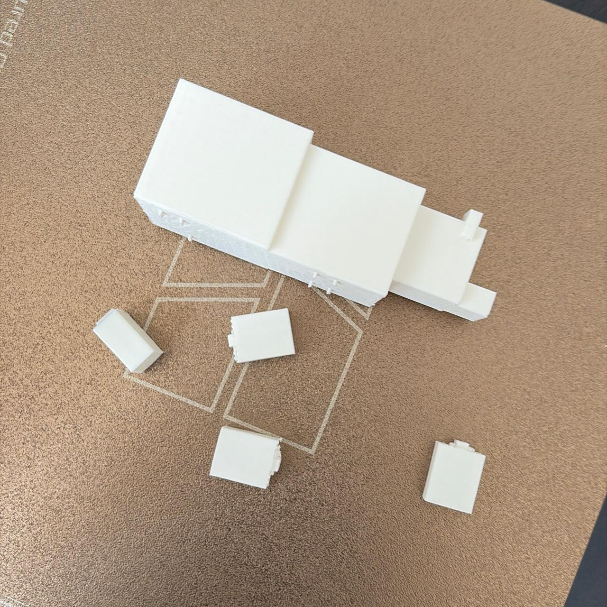
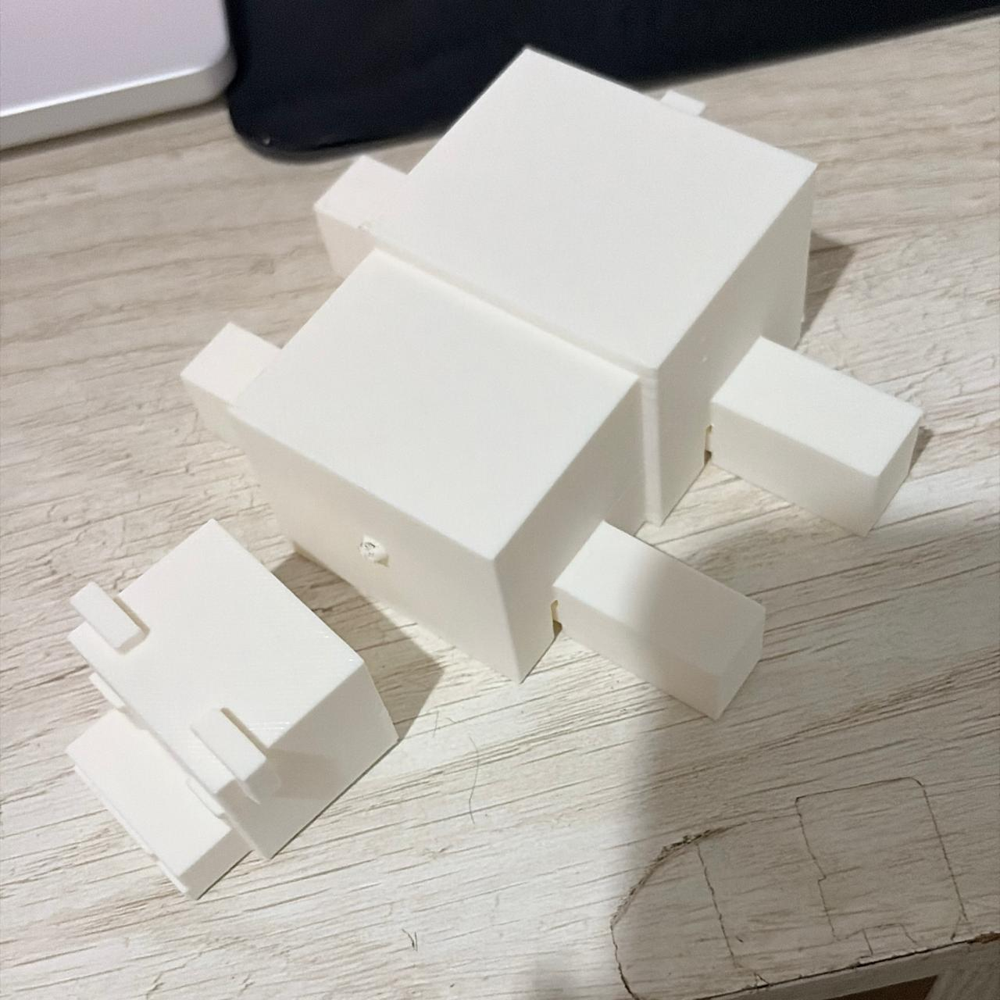
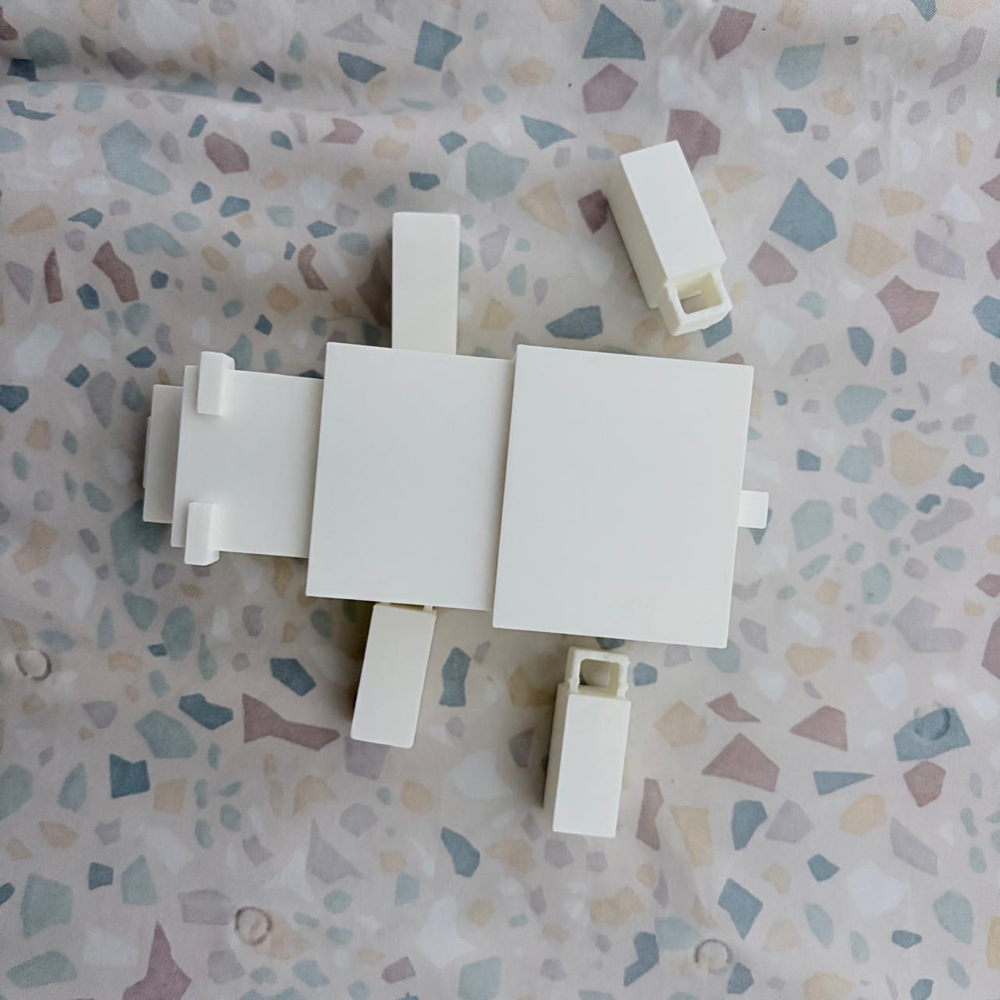
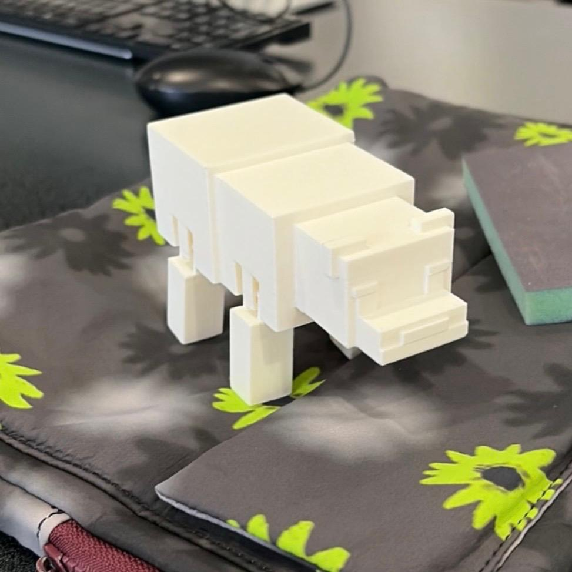

# Modelo Articulado 3D - Osito

## 1. Diseño y Modelado de Uniones en SolidWorks

El diseño del modelo se dividió en componentes principales: **cabeza, cuerpo, patas frontales y patas traseras**, integrados a través de un archivo de ensamble

* **Articulaciones tipo cadena (*Eslabones*):** Se diseñaron bucles interconectados trabajando con puentes. La clave del modelado consistió en garantizar una holgura adecuada para que las superficies de las patas y el cuerpo no se tocaran en el entorno 3D, evitando que el filamento las juntara al imprimir
* **Intento de articulación esférica (Cabeza):** Originalmente se planteó una unión conceptual inspirada en las articulaciones de cabeza de muñeca (esfera y cavidad para permitir rotación). Sin embargo, al modelarse a una escala muy pequeña, las tolerancias no fueron suficientes y el material se fusionó y luego se rompio

{ width=48% }{ width=48% }

---

## 2. Preparación de Impresión en Bambu Studio

Una vez validado el ensamble en SolidWorks, el archivo se exportó en formato **.STL** para su procesamiento en el software **Bambu Studio**, orientado a impresoras **Bambu Lab**

1. **Importación del STL:** Se cargó la estructura articulada completa en el laminador
2. **Orientación en la cama:** Se orientó y "pegó la cara plana al suelo" para maximizar la adhesión a la placa y permitir que las articulaciones superiores se imprimieran suspendidas mediante puentes y algunos soportes

{ width=48% }{ width=48% }
{ width=48% }{ width=48% }

---

## 3. Control de Calidad y Fallos 

Para lograr una pieza completamente articulada y funcional se requirieron **4 intentos de impresión**, resolviendo problemas de tolerancias mecánicas y resistencia del material:

| Intento | Falla Presentada | Causa Raíz | Solución Aplicada |
| :---: | :--- | :--- | :--- |
| **1** | Patas reventadas / fusionadas | Espacio entre eslabones insuficiente; el filamento derretido unió los componentes. | Se aumentó la holgura dimensional entre los anillos de la cadena en el CAD. |
| **2** | Rotura de la articulación de la cabeza | El cuello tipo rótula esférica era demasiado pequeño y frágil. | Se simplificó la unión a un sistema de eslabón pasante más robusto. |
| **3** | Rotura de patas traseras | Error en la alineación del ensamble digital que generó tensión estructural. | Se reajustó la posición de las patas traseras en el ensamble original de SolidWorks. |
| **4** | **Impresión exitosa** | Configuración correcta de puentes, holguras y orientación en cama. | Pieza final con movilidad fluida y sin fusiones. |

{ width=32% }
{ width=32% }
{ width=32% }

---

## 4. Resultado Final

Tras corregir las interferencias y ajustar el mecanismo de puenteo, la pieza logró articularse libremente al salir de la cama de impresión sin necesidad de ensamble posterior.

{ width=48% }{ width=48% }
---

## 5. Archivos del Proyecto

Puedes descargar la carpeta comprimida que contiene los archivos de piezas (`.SLDPRT`), el ensamble (`.SLDASM`), el modelo exportado (`.STL`) y el boceto inicial:

[**Descargar Archivos del Proyecto 3D (.ZIP)**](./ZIPS/Osito.zip)