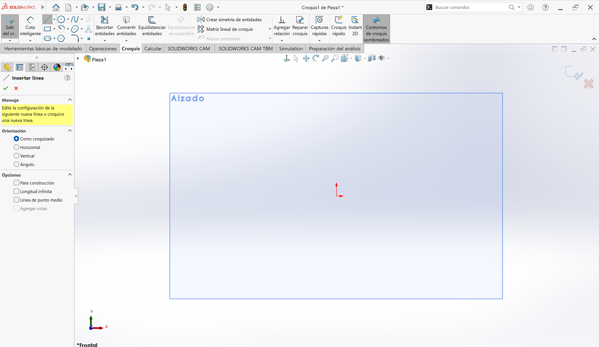
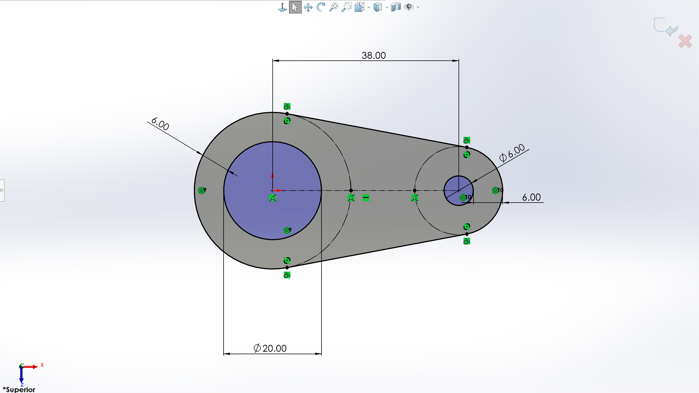
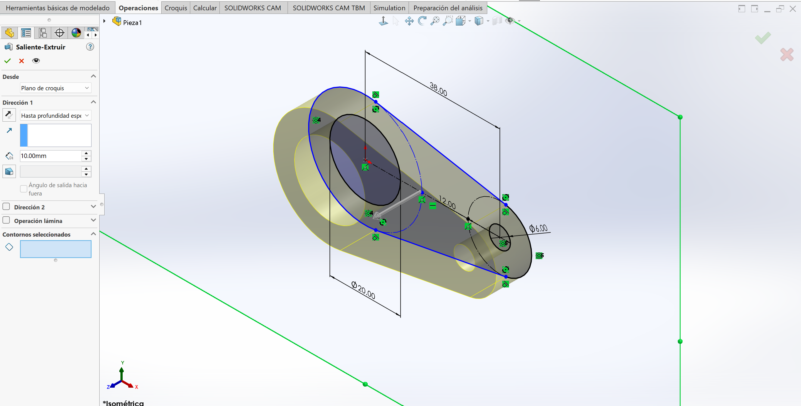
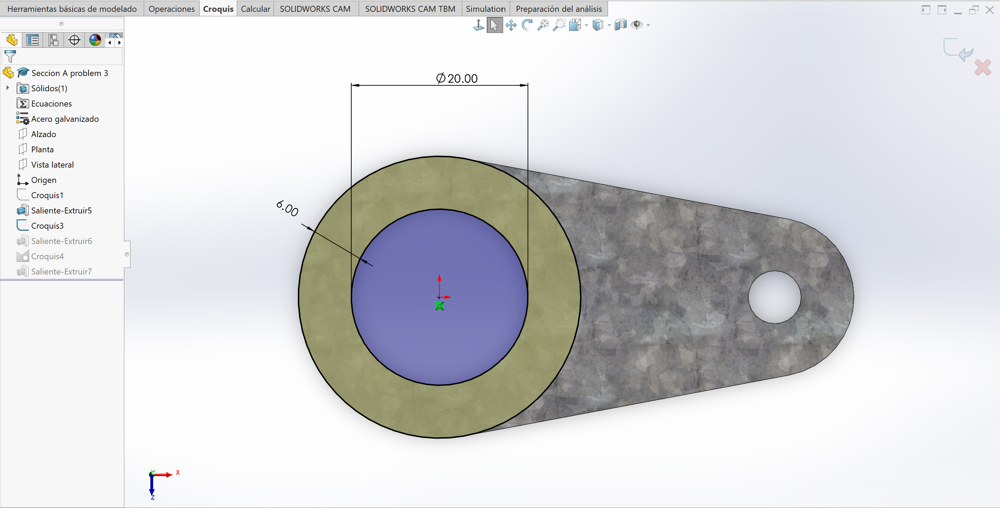
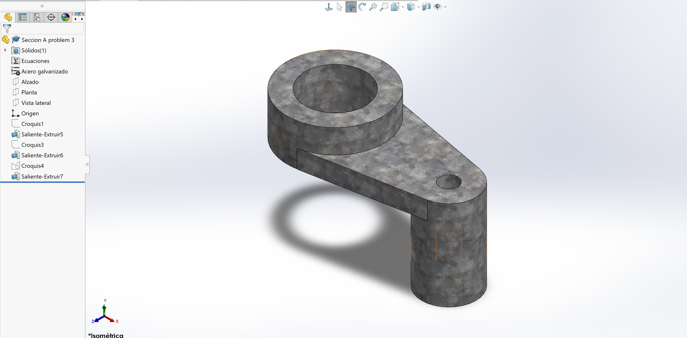

# Inicios en SolidWorks

En esta sesión aprendimos los fundamentos del dibujo digital en **SolidWorks**, desde la selección del plano inicial hasta la creación de operaciones de extrusión y corte

---

## 1. Selección del Plano y Creación de Croquis

Para comenzar cualquier pieza , el primer paso es definir sobre qué vista vamos a trabajar (**Alzado**, **Planta** o **Vista lateral**)

* **Práctica común:** Seleccionar el plano **Alzado** para dibujar el perfil frontal principal de la figura.
* Una vez elegido el plano, abrimos la herramienta **Croquis** para trazar las líneas base

{ width=50% }  

---

## 2. Restricciones y Cotas Inteligentes

Durante el trazado de líneas, es indispensable definir completamente la geometría para garantizar precisión:

* **Relaciones de posición (íconos verdes):** Permiten fijar líneas de forma **Horizontal**, **Vertical**, **Tangente** entre otros
* **Cota Inteligente:** Herramienta utilizada para asignar dimensiones exactas a los bordes o diámetros
* **Estado del Croquis:** 
  * **Líneas Azules:** Insuficientemente definido (se puede deformar)
  * **Líneas Negras:** Completamente definido (todas las dimensiones están fijas)

{ width=50% }  

---

## 3. Generación del Sólido 3D (Extruir)

Una vez que el perfil 2D está cerrado y bien definido en el croquis, cambiamos a la pestaña de **Operaciones**:

1. Seleccionamos la herramienta **Saliente/Extruir**
2. Asignamos la profundidad requerida según el plano técnico
3. Aceptamos la operación para generar el sólido

{ width=50% }  

---

## 4. Edición del Modelo: Cortes

Para añadir o quitar material sobre un cuerpo ya existente:

1. Hacemos clic en una cara plana del sólido o seleccionamos un nuevo plano
2. Creamos un nuevo **Croquis** en esa superficie
3. Dibujamos la figura requerida (por ejemplo, un círculo)
4. Usamos las herramientas de **Operaciones**:
   * **Extruir Corte:** Para quitar o perforar el material
   * **Saliente/Extruir:** Para añadir material o nuevas secciones

{ width=50% }  
{ width=50% }  

