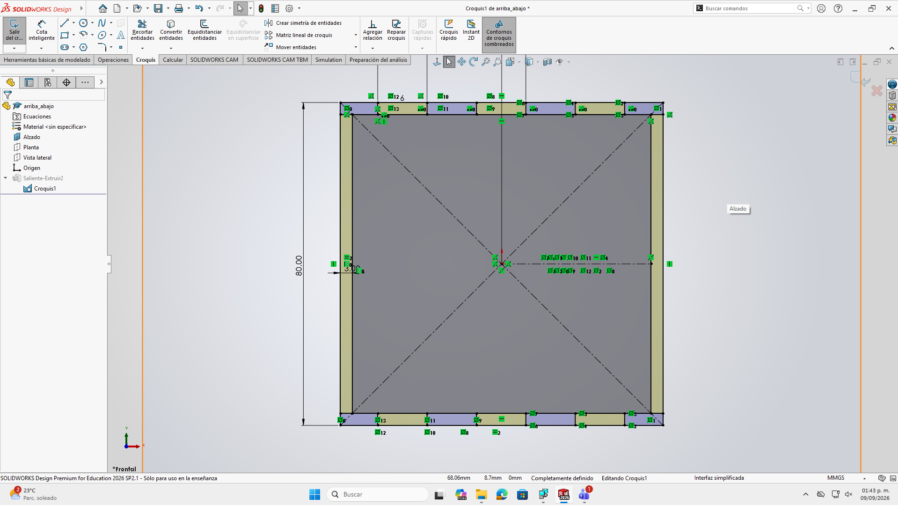
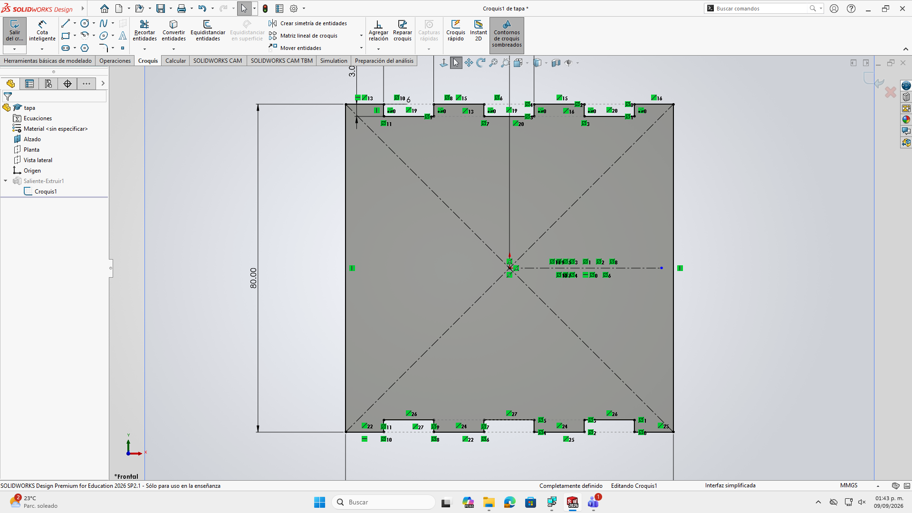
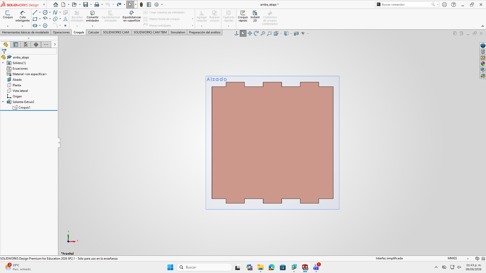
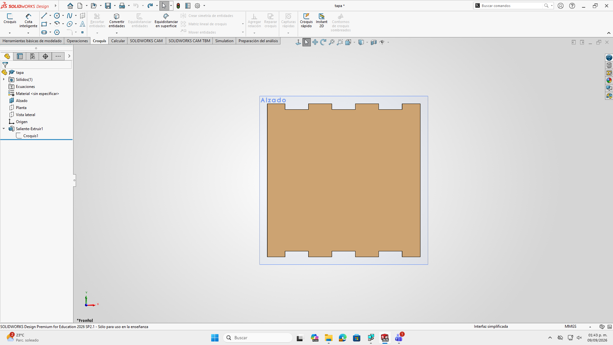
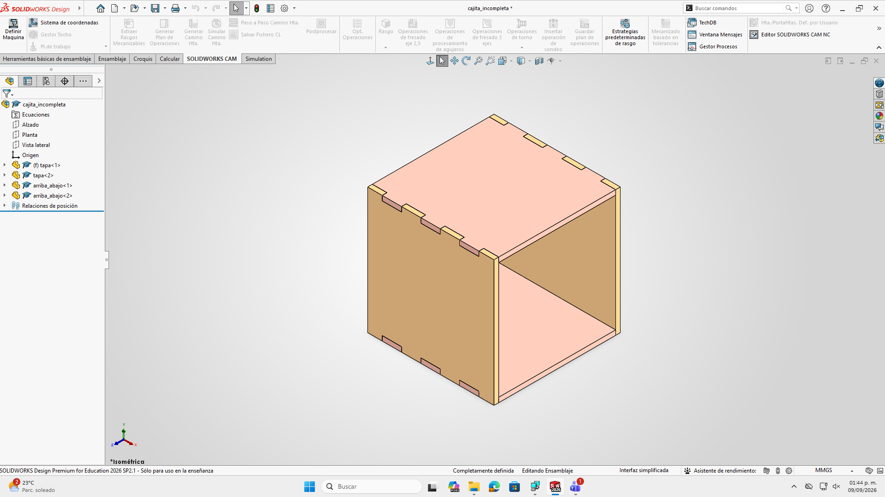
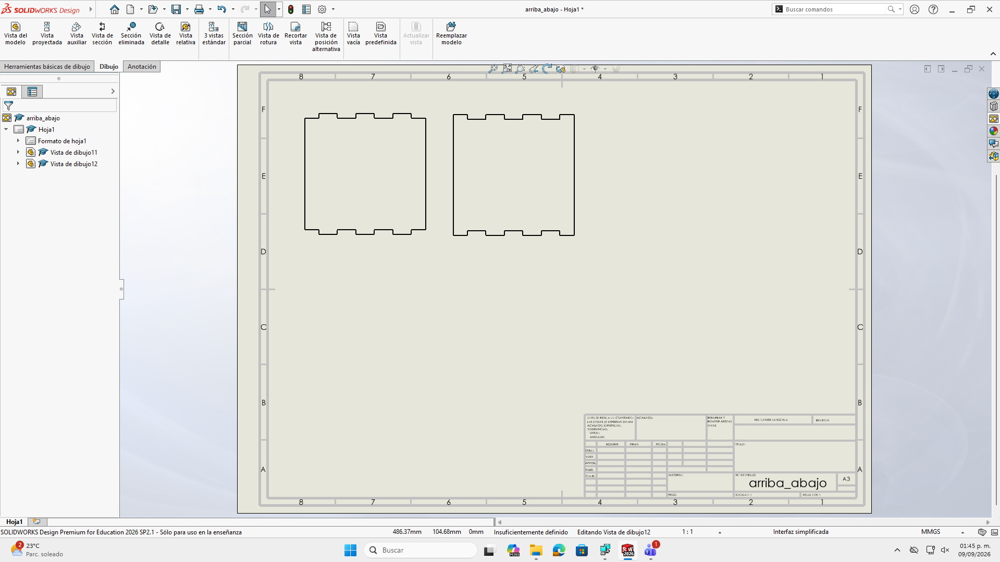

# Diseño de Ensambles 

En esta sesión dimos el salto del modelado de piezas individuales al **diseño de ensambles**, utilizando herramientas de duplicación eficiente y relaciones de posición para crear una cajita ensamblable con encajes tipo rompecabezas

---

## 1. Planificación Previa y Bocetaje
Antes de iniciar el modelado en la computadora, el primer paso fundamental es realizar un boceto a mano sobre papel:
* Permite conceptualizar las dimensiones generales y los tipos de encaje antes de trazar
* Optimiza el tiempo en software al tener claras las dimensiones y caras correspondientes

---

## 2. Herramientas Avanzadas de Croquis: Simetría y Matrices

Para optimizar el trazado de los perfiles y encajes de las caras de la caja, empleamos herramientas de automatización:

* **Simetría de entidades:** Permite reflejar trazados completos respecto a un eje de simetría.
* **Matriz lineal de croquis:** Herramienta utilizada para duplicar geometría definiendo la distancia exacta entre cada elemento y el número total de repeticiones

{ width=50% }  { width=50% }

---

## 3. Modelado de Piezas Sólidas

Siguiendo los criterios de diseño, generamos los archivos individuales de las piezas:

* Creación de la **cara frontal/lateral** y de la **tapa (superior/inferior)**
* Uso de la operación **Saliente/Extruir** respetando las cotas inteligentes para asegurar que las líneas se mantengan **completamente definidas (negras)**

{ width=50% }  { width=50% }

---

## 4. Creación e Inserción en el Ensamble

Una vez guardadas las piezas individuales, creamos un archivo nuevo de tipo **Ensamble**:

1. **Importación de componentes:** Se insertan las piezas requeridas desde la ventana del gestor de archivos (dos tapas y dos caras laterales)
2. **Relaciones de posición:** Se aplican restricciones geométricas entre las caras que van unidas
3. **Restricción de movimiento:** El objetivo es eliminar los **grados de libertad** de cada componente hasta que la estructura quede fija como un rompecabezas 3D

{ width=50% }

---

## 5. Formato DXF para Corte Láser

Para la fabricación física de las piezas en cortadora láser (en materiales como MDF):

1. **Creación del plano:** Se selecciona la opción de crear un **Dibujo / Plano** en SolidWorks
2. **Selección de caras:** Se acomodan las vistas de las caras planas que se van a cortar sobre la plantilla del plano
3. **Exportación a DXF:** El plano generado se guarda en formato **`.DXF`**
4. **Corte en taller:** Este archivo `.DXF` contiene la información geométrica 2D necesaria para enviarse directamente al software de la cortadora láser

{ width=50% }

---

## 6. Tipos de Uniones y Bisagras Vivas

Como complemento conceptual a la práctica, exploramos diversos métodos de fijación mecánica y patrones de corte para material flexible:

* 🔗 [Uniones y Bisagras Vivas](https://fabacademy.org/2024/labs/puebla/week3/?classId=1e963c5b-b506-48a9-a48b-a738aec38883)

### Bisagras Vivas:
1. **Patrón de corte:** Se diseña una serie de ranuras alternadas en un patrón de rejilla sobre la superficie fija
2. **Distribución:** Se utiliza la herramienta de **Matriz lineal** para repetir los cortes a distancias muy reducidas
3. **Flexibilidad:** Este tramado permite que un material rígido (como MDF) se dobles sin romperse al redistribuir la tensión a lo largo del corte